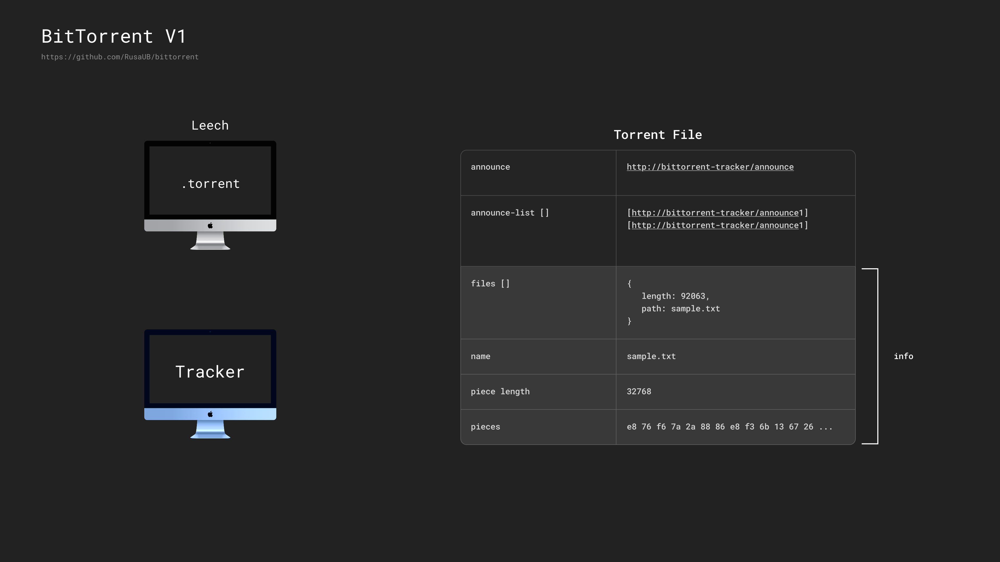

# BitTorrent V1 Simulation in Rust

This project simulates the behavior of the classic BitTorrent V1 protocol, fully implemented in **Rust**.
It focuses on core concepts such as trackers, peers, seeds, and file piece distribution, demonstrating the mechanics behind distributed file sharing.

[BEP 3 - The BitTorrent Protocol Specification](https://www.bittorrent.org/beps/bep_0003.html) specifically describes the original design of BitTorrent, including `.torrent` files, tracker communication, peer connections, and piece verification.

---

# Overview

BitTorrent is a peer-to-peer (P2P) protocol designed to efficiently distribute large files across multiple participants (peers) without overloading any single server.

Definitions: 

- **Tracker**: A central server that coordinates the list of peers but does not transfer data itself.
- **Seed**: A peer that has the **full copy** of the file and only uploads pieces to others.
- **Peer**: A client participating in the file exchange; it may have only a subset of the file.
- **Leech**: A peer that is still **downloading** the file and not yet a complete seed.

Dashed lines represent peer-to-peer (P2P) communication channels where file pieces are exchanged directly.

The Tracker only facilitates the initial peer discovery (via request/response), after which peers communicate directly without further Tracker involvement.

---

## Torrent File Structure

The structure of a `.torrent` file:

- **announce**: URL of the tracker server.  

  When a client reads a `.torrent` file, the first thing it looks for is the `announce` field.  
  The client uses this URL to send a request to the tracker and ask for a list of peers sharing the same file.

- **announce-list**: (Optional) A list of backup trackers. If the main tracker fails, clients can try others.

- **info**: A dictionary that contains detailed information about the shared file(s).  
  Inside the `info` dictionary : 

  - **name**: A suggested name for the file or directory when saving.
  - **files**: (If it is a multi-file torrent) Information about the files — their lengths and paths.
  - **piece length**: The size of each piece in bytes. Usually a power of two (e.g., 32KB, 256KB).
  - **pieces**: A single long sequence of SHA-1 hashes. Each 20-byte chunk corresponds to the expected hash of a file piece.

**Important Concepts:**
- The client needs to communicate with the tracker before it can find peers.
- The actual file description and piece hashes are located inside the `info` dictionary.
- Files are split into many small "pieces" for efficient sharing.
- Every piece is checked against its hash to guarantee data integrity and prevent corruption.