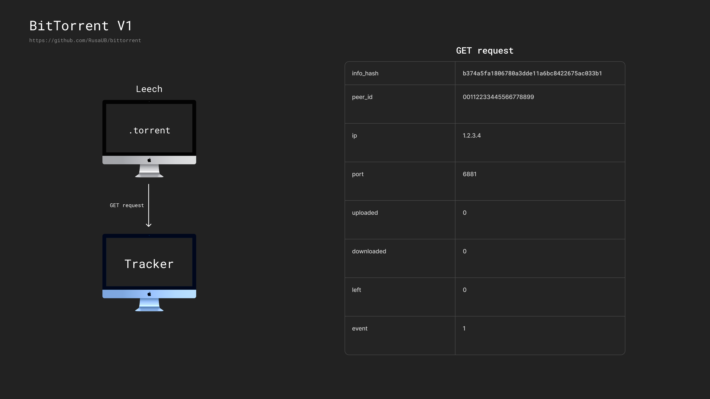
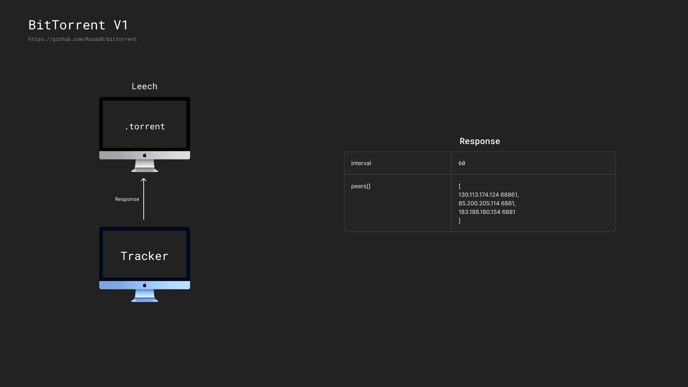
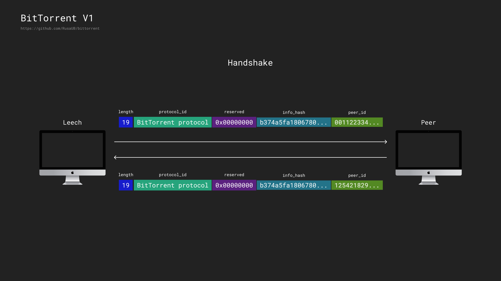

# BitTorrent V1 Simulation in Rust

This project simulates the behavior of the classic BitTorrent V1 protocol, fully implemented in **Rust**. It focuses on core concepts such as trackers, peers, seeds, and file piece distribution, demonstrating the mechanics behind distributed file sharing.

[BEP 3 - The BitTorrent Protocol Specification](https://www.bittorrent.org/beps/bep_0003.html) specifically describes the original design of BitTorrent, including `.torrent` files, tracker communication, peer connections, and piece verification.

---

# Overview

BitTorrent is a peer-to-peer (P2P) protocol designed to efficiently distribute large files across multiple participants without overloading any single server. The ecosystem consists of several key components working together:

The BitTorrent ecosystem consists of several key participants:

- **Tracker**: A central coordinator that maintains lists of peers but doesn't transfer any file data itself
- **Seed**: A peer with a complete copy of the file who only uploads to others
- **Peer**: A client participating in file exchange who may have a partial or complete copy
- **Leech**: A peer that is still downloading the file and not yet a complete seed

The communication pattern is straightforward: peers connect to the tracker initially to discover other participants, then establish direct P2P connections with each other to exchange file pieces. After the initial discovery phase, the tracker is no longer needed for the actual data transfer, making the system highly resilient.

---

## Torrent File Structure

A `.torrent` file contains all the metadata needed to join a swarm and download content. At its core is the `announce` URL pointing to the tracker server. When a client reads this file, it uses this URL to contact the tracker and request information about other peers sharing the same file. For redundancy, an optional `announce-list` may provide backup trackers in case the primary one fails.

The heart of a torrent file lies in its `info` dictionary. This section contains the suggested `name` for saving the file or directory and details about included `files` in multi-file torrents. Files are divided into equal-sized segments called "pieces" (usually powers of two like 32KB or 256KB), defined by the `piece length` parameter. Each piece is verified using SHA-1 hashes stored in the `pieces` field—a concatenated sequence where each 20-byte chunk corresponds to one file piece.

### Bencode Format

BitTorrent files employ a straightforward encoding format called "bencode" (pronounced "bee-encode") that supports four data types:

| Data Type   | Format                           | Example                | Decoded Value            |
|-------------|----------------------------------|-----------------------|--------------------------|
| String      | `<length>:<contents>`            | `5:hello`              | `"hello"`                |
| Integer     | `i<number>e`                     | `i42e`                 | `42`                     |
| List        | `l<item1><item2>...e`            | `l5:helloi42ee`        | `["hello", 42]`          |
| Dictionary  | `d<key1><value1><key2><value2>...e` | `d5:hello5:worlde`  | `{"hello": "world"}`     |

This efficient serialization format allows clients to decode .torrent files and extract all necessary information to participate in the swarm. The decoding process is the first step a client takes when joining a torrent.

For integrity and security, every file piece is validated against its corresponding hash, ensuring data remains uncorrupted during transfer. Before any peer interaction can begin, the client must first communicate with the tracker using information from the decoded torrent file.

## Tracker Communication

### GET Request

When a client wants to join a swarm, it initiates contact with the tracker through a GET request containing essential information:

The request includes the `info_hash` (SHA-1 hash of the info dictionary) that uniquely identifies the desired content. The client also sends its `peer_id` for identification, along with network details like `ip` address and listening `port`. 

Progress statistics are communicated through the `uploaded`, `downloaded`, and `left` parameters, which track how much data has been shared, received, and remains needed. The client's status is indicated by the `event` parameter, which can signal when a client has started, completed, or stopped its participation.

### Tracker Response

Upon receiving a request, the tracker responds with information about the swarm:

The response includes an `interval` value telling the client how frequently (in seconds) it should contact the tracker for updates. Most importantly, it provides a list of `peers` currently sharing the requested torrent, including their IP addresses and ports for direct connection.

This representation simplifies the actual implementation, which includes additional parameters and robust error handling to manage various edge cases.

## Peer Handshake

Before exchanging any data, peers must establish a connection through a handshake process:

The handshake message contains several fields in sequence: a `length` byte indicating the protocol string size (19 bytes), the `protocol_id` string ("BitTorrent protocol"), eight `reserved` bytes for protocol extensions, the `info_hash` to confirm both peers want the same content, and the sender's `peer_id`.

Both sides must exchange these messages and verify that the received info_hash matches their expected torrent. Only after successful verification can peers begin exchanging actual file data. This handshake ensures that connections are established only between peers interested in the same content and provides basic identity verification.
